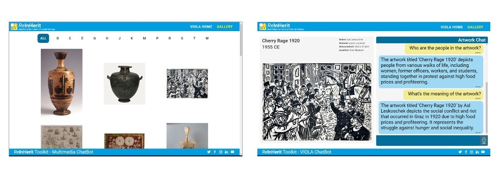

# ReInHerit Multimedia Chatbot

This application is part of the **ReInHerit Toolkit**.


**Chatbots** have been recently popularized by the emergence of tools like ChatGPT.
This system offers two different chatbots: 

- one based on Visual Question Answering techniques, using a neural network to classify the types of questions of the users in questions related to visual content or to the context of the artwork, and then using a specific neural network for each type of question, and the other method uses GPT-based networks to answer, again, questions on content and context.


- Each modality is maintained in a different branch of the repository. The main branch contaning only the VQ system, the GPT3_VQA allows to use on or the opther method, based on a parameter in a configuration file, and then GPT3_only uses only GPT network.


## Citation

If you use this software in your work please cite:

- ```P. Bongini, F. Becattini, A.D. Bagdanov, A. Del Bimbo, “Visual question answering for cultural heritage”, IOP Conference Series: Materials Science and Engineering, 2020```

- ```P. Bongini, F. Becattini, A. Del Bimbo, “"Is GPT-3 all you need for Visual Question Answering in Cultural Heritage?", Proc. of European Conference on Computer Vision workshops, 2022```


## Acknowledgements
This work was partially supported by the European Commission under European Horizon 2020 Programme, grant number 101004545 - [ReInHerit](https://www.reinherit.eu).

